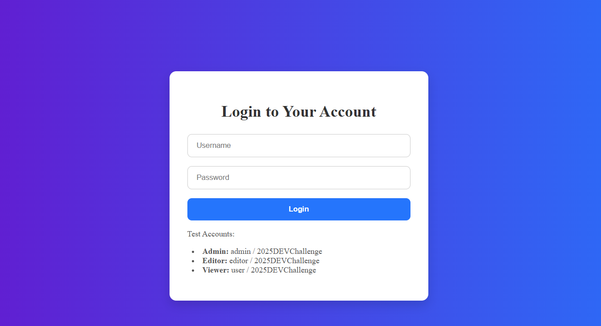
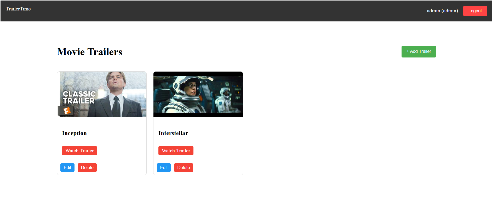
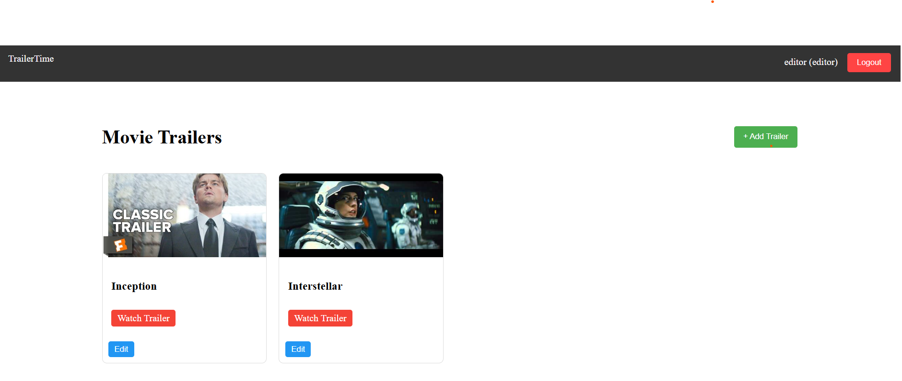
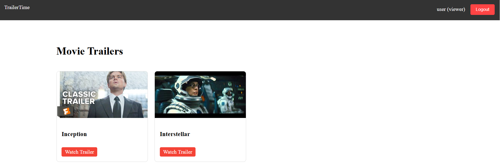

# 🎬 TrailerTime

Welcome to **TrailerTime** — a Netflix-style web app built just for showcasing **movie trailers**! Whether you're a movie buff or just browsing for the next epic teaser, TrailerTime lets you explore a curated list of trailers with stunning posters — all with the magic of **role-based access control**, powered by [Permit.io](https://www.permit.io).

> 🚀 This project is part of the **Permit.io Authorization Challenge** under the _"Permissions Redefined"_ prompt.

---

## 📚 Table of Contents

- [✨ Features](#-features)
- [🛠️ Tech Stack](#-tech-stack)
- [🔐 Authorization with Permit.io](#-authorization-with-permitio)
- [💻 Installation](#-installation)
- [🚀 Running the Application Locally](#-running-the-application-locally)
- [🖼️ Screenshots](#-screenshots)
- [📈 Future Improvements](#-future-improvements)
- [🤝 Contributing](#-contributing)
- [📄 License](#-license)

---

## ✨ Features

- 🎥 **Browse Trailers** – View a sleek list of movie trailers with posters.
- 🔐 **Role-Based Authorization**:
  - 👑 **Admin** – Create, update, read, and delete trailers.
  - ✍️ **Editor** – Create, update, and read trailers.
  - 👤 **User** – Read-only access to view trailers.
- 🧠 **Dynamic UI** – Buttons like Create, Edit, and Delete appear based on user roles.
- 🔑 **Secure Auth** – Integrated with **Permit.io** for robust access control.
- 📱 **Responsive Design** – Works on desktop and mobile devices.

---

## 🛠️ Tech Stack

| Layer       | Tech Used                         |
|-------------|-----------------------------------|
| Frontend    | React.js                          |
| Backend     | Node.js, Express.js               |
| AuthZ       | Permit.io (Policy-as-Code + CLI)  |
| Database    | Sqlite                            |
| Styling     | CSS                               |

---

## 🔐 Authorization with Permit.io

**TrailerTime** uses [Permit.io](https://www.permit.io) to handle access control across the app — the right user sees the right things.

### 🎭 Roles Defined:

```yaml
roles:
  admin:
    permissions:
      - trailer:create
      - trailer:update
      - trailer:read
      - trailer:delete
  editor:
    permissions:
      - trailer:create
      - trailer:update
      - trailer:read
  user:
    permissions:
      - trailer:read
```

### 🔧 Permit.io Integration Highlights:

- Defined policies using **Permit CLI**.
- Synced with **Permit.io dashboard**.
- Integrated **frontend SDK** to show/hide UI based on role.
- Enforced **backend policies** to secure API actions.

---

## 💻 Installation

### ✅ Prerequisites

- Node.js (v16+)
- npm
- A [Permit.io](https://www.permit.io) account + API key
- Sqlite 

### 🧰 Setup Steps

```bash
# 1. Clone the repo
git clone https://github.com/NahidaAnjum/TrailerTime.git
cd TrailerTime

# 2. Install frontend dependencies
cd frontend
npm install

# 3. Install backend dependencies
cd ../backend
npm install
```

### 🛠️ Configure Environment Variables

Create a `.env` file in the `backend/` folder:

```env
PERMIT_API_KEY=your_permit_api_key
PORT=5000
```

### 🔄 Set Up Permit.io

```bash
# Install CLI
npm install -g @permitio/permit-cli

# Login
permit login

# Sync policies
permit sync
```

---

## 🚀 Running the Application Locally

### ▶️ Start the Backend

```bash
cd backend
npm start
# Backend at http://localhost:5000
```

### ▶️ Start the Frontend

```bash
cd frontend
npm start
# Frontend at http://localhost:3000
```

Open your browser at [http://localhost:3000] and enjoy 🎬

---

## 🖼️ Screenshots

### Login page
> 

### 👑 Admin Dashboard
> 

### ✍️ Editor View
> 

### 👤 User View
> 

---

## 📈 Future Improvements

- 🎨 Upgrade UI with Tailwind CSS or Material UI.
- 🔍 Add search and filtering for trailers.
- 🎬 Categorize by genre or release date.
- 💾 Integrate a real database for persistent storage.
- 🙍 User profiles and personalized recommendations.

---

## 🤝 Contributing

We love contributions! Here's how to get started:

```bash
# 1. Fork the repo
# 2. Create your feature branch
git checkout -b feature/amazing-feature

# 3. Commit your changes
git commit -m "Add amazing feature"

# 4. Push the branch
git push origin feature/amazing-feature

# 5. Create a Pull Request
```

---

## 📄 License

This project is licensed under the [MIT License](./LICENSE).

---

Made with ❤️ for the Permit.io Authorization Challenge!